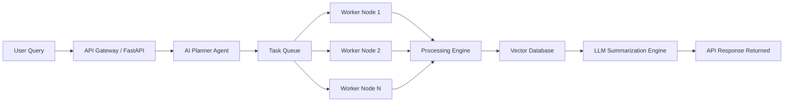
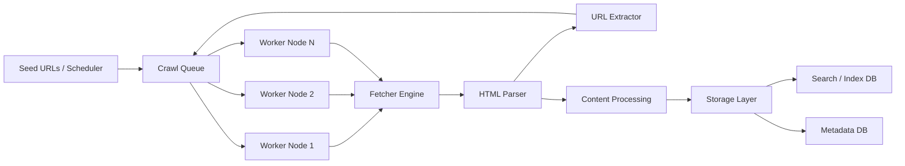
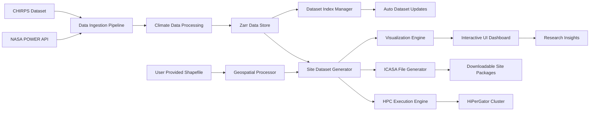

# 👋 Hi, I'm Mohammad Wael

💻 Backend Engineer | Distributed Systems | AI Systems  
🎓 M.S. Computer Science — University of Florida  
🚀 Building scalable infrastructure, developer tools, and intelligent systems

---

# 🧠 About Me

I'm a backend-focused software engineer specializing in **distributed systems, scalable APIs, and AI-powered platforms**.

My work spans **cloud infrastructure, data pipelines, compiler design, and agentic AI systems**, with a strong focus on building **production-grade systems that scale**.

Currently working on **large-scale climate data pipelines and HPC-based research infrastructure at the University of Florida.**

### Core Interests

• Distributed Systems  
• AI Agent Infrastructure  
• Data Pipelines & Research Platforms  
• Backend Architecture  
• Compiler Design  

---

# 🛠 Tech Stack

### Languages
Java • Go • Python • C • SQL • JavaScript

### Backend & Systems
Spring Boot • REST APIs • Microservices • Kafka • Redis

### AI / Data
LLM APIs • Vector Databases • Data Pipelines • Zarr

### Databases
PostgreSQL • MySQL • MongoDB • Redis

### Cloud & DevOps
AWS • Docker • CI/CD • GitHub Actions

### Research & HPC
Python Scientific Stack • Climate Data Processing • HPC Workloads

---

# 🚀 Featured Projects

---

# 🤖 Autonomous AI Task Orchestrator

A distributed **agentic AI execution system** that converts user requests into coordinated tasks executed by distributed workers.

### Architecture

### Features

• AI planner that decomposes complex tasks  
• Distributed worker execution system  
• Vector database knowledge storage  
• LLM summarization pipeline  
• Scalable queue-based architecture  

### Tech

Python • FastAPI • Redis • Celery • Vector DB • LLM APIs

---

# 🌐 Distributed Web Crawler

High-performance distributed web crawler designed for **large-scale data collection and indexing**.

### Architecture

### Capabilities

• Distributed crawling workers  
• Queue-based URL scheduling  
• Rate limiting and politeness policies  
• Content parsing and indexing  
• Scalable horizontal architecture

### Tech

Go • Kafka • Redis • PostgreSQL • Docker

---

# 🌍 NASA Weather + CHIRPS Research Data Platform

Large-scale **climate data pipeline and research platform** developed at the **University of Florida**.

The platform integrates:

• NASA POWER weather datasets  
• CHIRPS precipitation datasets  
• Geographic shapefile-based site analysis  

### Architecture

### Key Capabilities

• Automated ingestion of climate datasets  
• Zarr-based data storage and indexing  
• Automatic dataset updates when new data becomes available  
• HPC deployment on UF **HiPerGator** cluster  
• Scientific experiment execution workflows  

### Research Tools

• Site-specific dataset generation via shapefiles  
• Automated ICASA file generation  
• Interactive UI for data visualization and insights  
• Plot generation and data downloads  

### Impact

This platform **replaces a previously manual research workflow**, significantly reducing time required for climate data preparation for agricultural and environmental scientists.

### Tech

Python • Zarr • Climate Data APIs • HPC (HiPerGator) • React • Data Visualization

---

# ⚙ Pascal++ — Object-Oriented Pascal Compiler

Designed and implemented an **object-oriented extension to Pascal** with a full compiler pipeline.

### Features

• Classes and inheritance  
• Access modifiers  
• Semantic analysis  
• LLVM IR code generation  

### Tech

ANTLR4 • LLVM • Compiler Design • Language Engineering

---

## 📈 GitHub Activity

  
  

---

# 🌐 Connect With Me

💼 LinkedIn  https://linkedin.com/in/itswael

🌐 Portfolio  https://itswael.github.io

📧 Email  errwael@gmail.com

---

# ⚡ Fun Fact

I enjoy building systems that replace manual workflows with automation — from AI task orchestration engines to research data pipelines that process climate datasets on HPC clusters.

---

⭐ Explore my repositories and feel free to collaborate!
